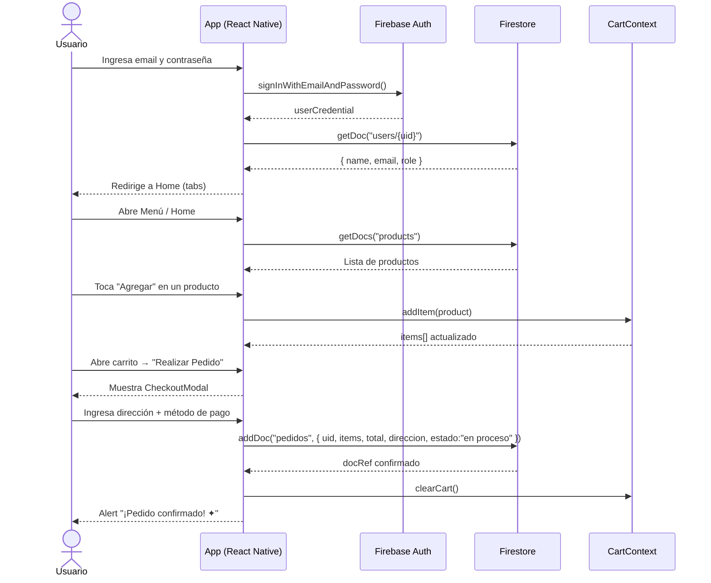
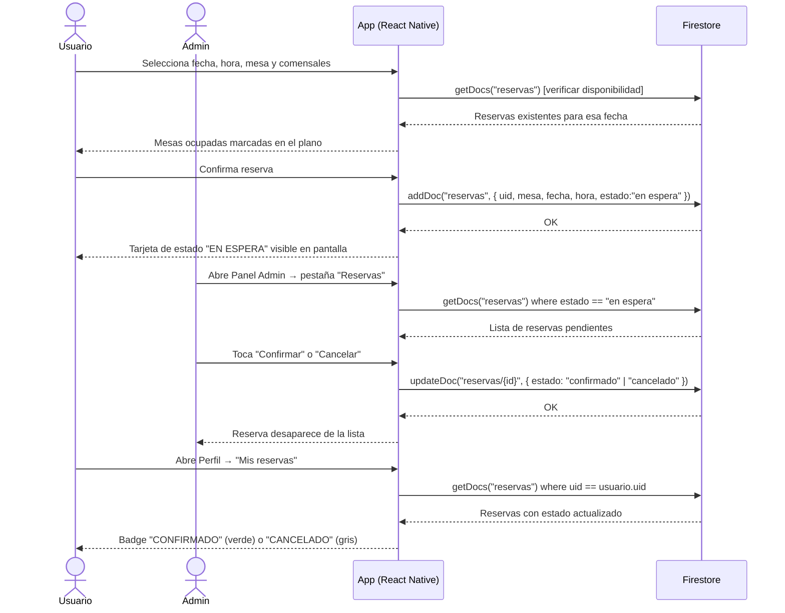
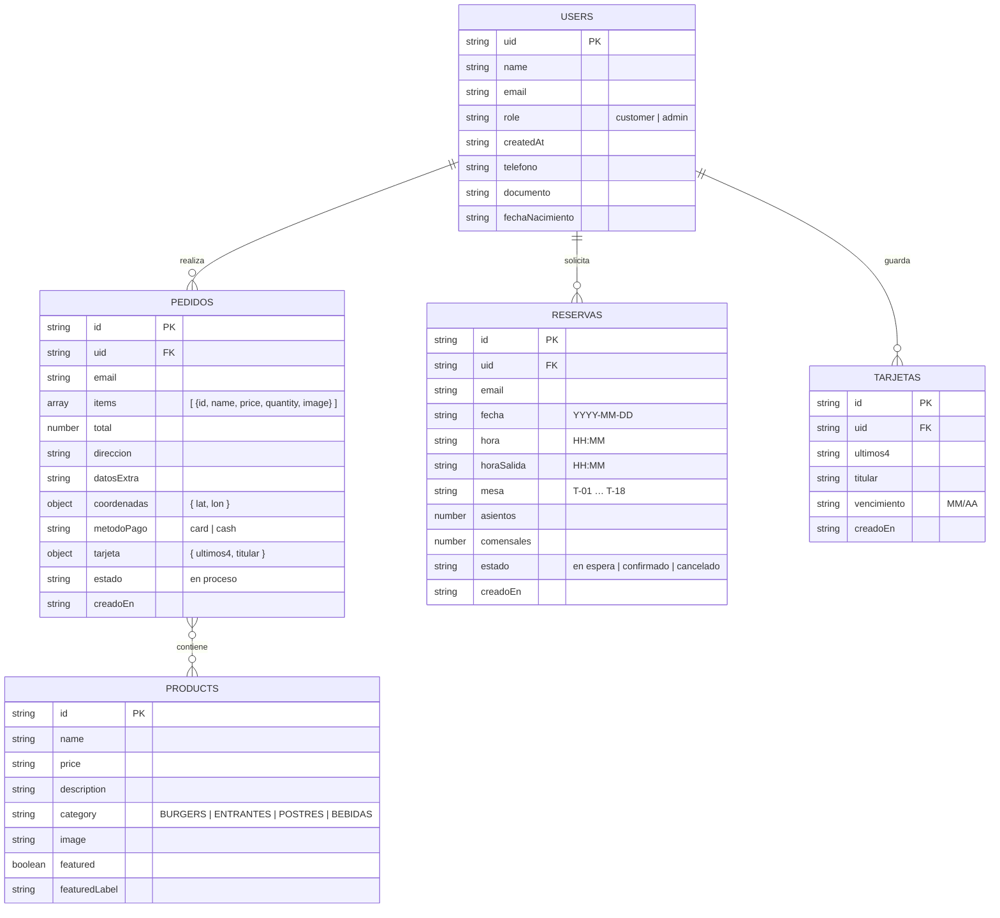
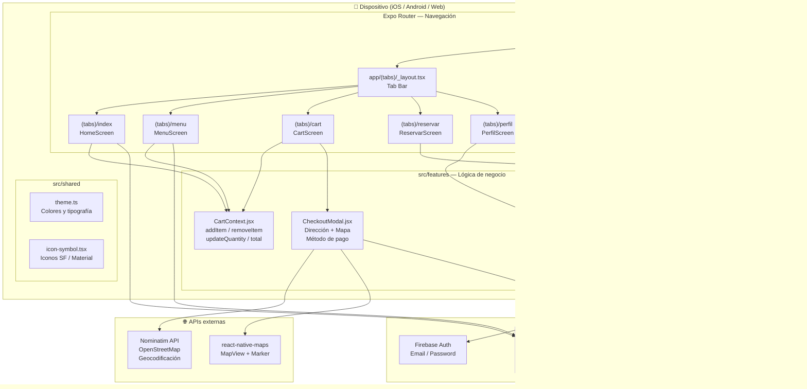

# Diagramas — Pecados Placenteros

---

## 1. Diagrama de Secuencia — Flujo principal: Pedido de un cliente

---

## 2. Diagrama de Secuencia — Flujo de Reserva

---

## 3. Diagrama Entidad-Relación — Modelo real de Firestore

---

## 4. Diagrama de Componentes — Arquitectura lógica

